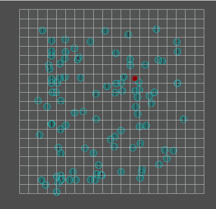

# FlowField
I am a student game development at the university of HOWEST, and This is an overview of how I implemented the use of a flowfield.

<h1>What is a flowfield? </h1>
Imagine you want hundreds of agents scattered around the level to move to the same destination. You could calculate a path for every agent using A* path finding algortihm, but this would be very costly because of the huge amount of agents we have. A better way to approach this is to use a flowfield. A flow field guides the agents to their destination by telling the agent which way to go without having to calculate a path for every single agent.

<h2>How does it work? </h2>
I have a grid that represents my flowfield. Every node will "point" to the best direction to go, and the agent will go to that direction. 
Here is my example.

<h1>My implementation </h1>
<h2>The framework</h2>
Since this is a school project I already had a framework that I could use. This framework was given to us at the beginning of the semester and it already contains a grid that can have different types of terrain nodes.
<ul>
  <li>Water, cost 200001</li>
  <li>Mud, cost 3</li>
  <li>Ground, cost 1</li>
</ul>
Every node contains a cost to walk over. Water has a cost of 200001 which means you can not go over it.
Here you see I changed the terrain. As you can see the flowfield will guide you around the mud because that would be much faster in this case.

But if I change it a bit like this, you see it does let me pass over the mud to reach my goal faster.

<h2>Make an integrationfield</h2>

Since we already know the costs of each node we don't need to make a costfield so we can skip this. 
How do we find the best path to our destination? We need an integrationfield for this. The integrationfield contains the cost from every grid to our destination. In the image you can see an example.

So I made a function GenerateIntegration field which takes the end node as a parameter. I start with giving each node in my integration field a best cost of 200001, the end node gets a bestCost of 0 and I put this one in the openlist(contains nodes we need to check).

Then I loop over all elements in the openlist until there are no nodes left. in this loop we want to go over all our node connections of the currentNode and calculate the cost to each neighbouring node, if this cost is lower than the best cost of our neighbour we want to set the bestcost of that neighbour to the cost we just calculated.

now check if this neighbournode is already in the closedlist(contains all nodes we already checked) if it is not you can add it to the openlist. We do this because otherwise we would have an infiite loop, we only want to check the connections of each node once.

After you checked all of the connections you can add the currentNode to the closedlist and remove it from the openlist.
If done correctly every node now contains the bestCost to the destination.
<h2>Make your flowfield</h2>
Now that we have our integrationfield we can make our flowfield. I made a function GenerateFlowfield which also takes the endnode as a parameter.
The first thing I do is clear my previous flowfield. Then I loop over all my nodes and again for every node loop over every neighbouring node.
The first thing I do is to check if the neighbouring node is the endnode. If this is the case I break out of my loop.

If this is not the case I search for the neighbour with the lowest cost.

Now that we have our neighbour with the lowest cost we can calculate a direction by subtracting the neighbour position with our current node's position and add this vector to our flowfield. And that is how you calculate a flowfield!
<h2>Final thing to do</h2>
now that we have our flowfield we have one thing to do. We need to tell our agent what direction to go and luckily for us this is very simple. All you need to do is get the index of the node your agent is in and get the vector you stored in that node and aplly it on your agent.

<h1>Example of how to use a flowfield</h1>
I made a small example of how you could use a flowfield. Imagine you are making some sort of strategy game and have 2 groups that can atttack, red and blue in this case. You want to play smart and approach the enemy from 2 different sides, thanks to our flowfield this is a piece of cake. Give each group it's own flowfield, integrationfield and destination and you are good to go. See my example in the gif below, I made an extra Checkbox "Blue agents". If it is selected we are controlling the blue agents otherwise we control the red agents.

